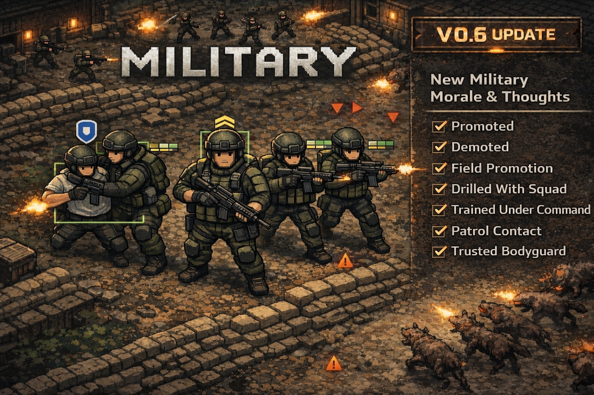

<div align="center">

# ⚔️ Military — RimWorld Mod




<br/>

**A full military command structure for your RimWorld colony.**  
Ranks. Patrols. Bodyguards. Missions. Combat Progression.

<br/>

[📦 Download Latest](../../releases/latest) · [🐛 Report Bug](../../issues) · [💡 Request Feature](../../issues) · [📖 Changelog](#-changelog)

<br/>

---

</div>

## 📋 Table of Contents

- [Overview](#-overview)
- [Features](#-features)
- [Rank System](#-rank-system)
- [Patrol System](#-patrol-system)
- [Bodyguard & Defend System](#-bodyguard--defend-system)
- [Military Tab](#-military-tab)
- [Combat Training](#-combat-training)
- [Phantom Strike Force Scenario](#-phantom-strike-force-scenario)
- [Translations](#-translations)
- [Requirements](#-requirements)
- [Installation](#-installation)
- [Compatibility](#-compatibility)
- [Changelog](#-changelog)

---

## 🎯 Overview

**Military** transforms your colony's fighters into a structured fighting force with real hierarchy and tactical control. Soldiers earn promotions through combat kills, gain meaningful stat bonuses at each rank, and can be assigned to patrol routes, bodyguard duties, or defensive zones — all managed from a single dedicated Military tab.

> *Only battle-hardened colonists climb the ranks. Every kill counts.*

---

## ✨ Features

<table>
<tr>
<td width="50%">

**🎖️ Rank System**
- 5 ranks from Recruit to Lieutenant
- Promotions gated by real combat kills
- Unique stat bonuses per rank
- Aura effects for senior ranks
- Mood buffs for ranked soldiers
- Promote / demote from UI

</td>
<td width="50%">

**🗺️ Patrol System**
- Assign patrol routes with up to 4 waypoints
- Requires minimum 2 waypoints
- Patrol breaks when enemy detected nearby
- Start / stop from Military tab
- Patrol status shown at a glance

</td>
</tr>
<tr>
<td width="50%">

**🛡️ Bodyguard & Defend**
- Assign bodyguards to protect VIP pawns
- Maximum 2 bodyguards per VIP
- Define defend areas by clicking two corners
- Remove assignments at any time
- Status visible in Military tab

</td>
<td width="50%">

**🏋️ Combat Training**
- Assign training dummies for melee, ranged, or both
- Daily training with completion tracking
- Trains combat skills passively
- Cancel training assignment anytime

</td>
</tr>
<tr>
<td width="50%">

**📊 Military Tab**
- Full overview of all military pawns
- Columns for rank, kills, progress, weapon, patrol
- Quick actions inline per soldier
- Promotion eligibility notifications

</td>
<td width="50%">

**🎮 Phantom Strike Scenario**
- Custom 3-mission narrative scenario
- Elite black-ops squad behind enemy lines
- Custom faction: Helix Corporation
- Unique rewards and fail conditions

</td>
</tr>
</table>

---

## 🎖️ Rank System

Ranks are earned through **real combat kills** — no grinding, no shortcuts. Each rank comes with a stat bonus and higher ranks grant auras affecting nearby allies.

| Rank | Stat Bonus | Type |
|------|-----------|------|
| 🔵 **Recruit** | — | Starting rank |
| 🟢 **Private** | +3% Shooting Accuracy | Personal |
| 🟡 **Corporal** | +5% Move Speed | Personal |
| 🟠 **Sergeant** | +3% Shooting Accuracy | **Aura** (nearby allies) |
| 🔴 **Lieutenant** | −5% Aim Time | **Aura** (squad) |

> Promotion eligibility is shown as a notification and visible in the Military tab. You can also manually promote or demote any soldier at any time.

---

## 🗺️ Patrol System

Assign soldiers to walk a defined route automatically — they'll patrol indefinitely and break off to engage threats before returning to their post.

**How it works:**
1. Select a colonist in the Military tab
2. Click **Assign Patrol**
3. Click up to **4 waypoints** on the map (minimum 2 required)
4. Right-click to finalize early
5. The soldier walks the route on a loop
6. If an enemy is detected nearby → patrol breaks → soldier engages → returns to patrol after

---

## 🛡️ Bodyguard & Defend System

**Bodyguard:**
- Select a soldier → click **Assign Bodyguard** → select the VIP to protect
- The soldier will follow and protect the VIP at all times
- Each VIP can have a maximum of **2 bodyguards**
- Remove anytime with **Stop Bodyguard**

**Defend Area:**
- Select a soldier → click **Assign Defend Area**
- Click two corners on the map to define the zone
- The soldier will hold and defend that area
- Remove anytime with **Stop Defending**

---

## 📊 Military Tab

A dedicated tab gives you complete oversight of your entire fighting force in one place.

| Column | Description |
|--------|-------------|
| **Name** | Soldier portrait and name |
| **Rank** | Current military rank |
| **Squad** | Assigned squad |
| **Kills** | Total confirmed kills |
| **Progress** | Kills toward next promotion |
| **Weapon** | Currently equipped weapon |
| **Patrol** | Patrol route status |
| **Actions** | Promote, Demote, Patrol, Bodyguard, Defend |

---

## 🏋️ Combat Training

Place training dummies and assign soldiers to sharpen their skills daily.

| Mode | Description |
|------|-------------|
| **Train Combat** | Both melee and ranged training |
| **Train Melee** | Melee only |
| **Train Ranged** | Ranged only |
| **Cancel Training** | Remove designation |

Soldiers receive a message when they've trained enough for the day. Training completion is tracked and logged.

---

## 🎮 Phantom Strike Force Scenario

> *Four elite black-ops soldiers. Their unit was wiped out. Dropped behind enemy lines with one order: survive and dominate.*

A custom narrative scenario with 3 sequential missions against the **Helix Corporation** — a ruthless Erasure Division that does not negotiate, does not retreat, and does not stop.

---

### Mission 1 — No Safe Ground

> *Helix has triangulated your drop pod signature. A full eraser team is converging.*

| | |
|---|---|
| **Objective** | Eliminate the entire Helix advance team |
| **Fail Condition** | Lose any single operator |
| **Reward** | 300 wood · 200 steel · 10 components · 10 medicine |

---

### Mission 2 — Vanguard's Shadow

> *Silas Vane, a Helix defector, arrives carrying their most sensitive data. He needs 7 days.*

| | |
|---|---|
| **Objective** | Keep Silas Vane alive for 7 days |
| **Fail Condition** | Vane is killed |
| **Reward** | 5,000 silver |

---

### Mission 3 — Iron Verdict

> *Vane's files reveal the Helix forward base. Command has authorized a counter-strike.*

| | |
|---|---|
| **Objective** | Eliminate Director Kael Voss (Helix Commander) |
| **Fail Condition** | Entire force wiped out |
| **Reward** | 2,000 silver · 500 steel · 30 components · 20 glitterworld medicine |

---

## 🌍 Translations

| Language | Status |
|----------|--------|
| 🇬🇧 English | ✅ Full |
| 🇷🇺 Russian | ✅ Full |
| 🇨🇳 Chinese Simplified | ✅ Full |

Want to contribute a translation? Open a pull request with a new file under `Languages/[YourLanguage]/Keyed/`.

---

## 📦 Requirements

**Required:**
| Mod | Link |
|-----|------|
| Harmony | [Steam Workshop](https://steamcommunity.com/sharedfiles/filedetails/?id=2009463077) |

**Optional:**
| Mod | Purpose |
|-----|---------|
| [RH2] Rimmu-Nation² - Clothing | Enhanced Helix Corporation soldier appearance |

---

## 💾 Installation

**Steam Workshop:**
1. Subscribe to the mod on Steam Workshop
2. Enable it in the RimWorld mod manager
3. Place it **after Harmony** in load order

**Manual:**
1. Download the latest release from the [Releases page](../../releases/latest)
2. Extract into:
```
Windows: C:\Users\[Username]\AppData\LocalLow\Ludeon Studios\RimWorld by Ludeon Studios\Mods\
Linux:   ~/.config/unity3d/Ludeon Studios/RimWorld by Ludeon Studios/Mods/
Mac:     ~/Library/Application Support/RimWorld/Mods/
```
3. Enable in the RimWorld mod manager
4. Load **after Harmony**

---

## ✅ Compatibility

- ✅ RimWorld **1.6**
- ✅ Compatible with most combat mods
- ✅ Compatible with Rimmu-Nation² clothing
- ⚠️ May conflict with mods that heavily modify the pawn tab system

---

## 📝 Changelog

### v0.5
- Fixed military responders and bodyguards dropping their duties and reassigning repeatedly
- Added the military response system source and damage tracking patch to the repo
- Completed and synced English, Russian, and Chinese localization coverage
- Updated Mission 2 reward text to match the actual 5,000 silver reward

### v0.4.1
- Added **Chinese Simplified** translation (full coverage)
- Added **Russian** translation (full coverage)
- Covers all UI: tab name, column headers, ranks, missions, patrol, bodyguard, training

### v0.4.0
- Initial public release
- Full rank system (Recruit → Lieutenant)
- Patrol system with waypoints
- Bodyguard and defend area system
- Military tab with full pawn overview
- Phantom Strike Force scenario (3 missions)
- Combat training dummy system
- Full English localization

---

<div align="center">

Made with ❤️ for the RimWorld modding community

⭐ If you enjoy this mod, leave a star on GitHub or a rating on the Workshop!

</div>
